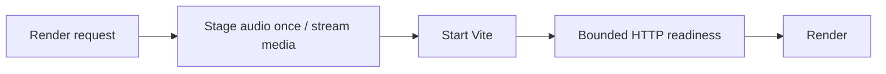

Render staging currently appends base64 audio through many sandbox commands, buffers R2 media transfers, and waits a fixed five seconds for Vite. This writes staged audio in one sandbox operation, streams known-length R2 transfers, uses sequential multipart staging for unknown-length uploads, and waits for bounded loopback readiness instead of a fixed sleep.

The streaming path retains the destination until upload completion and handles empty input, cancellation and locked streams. Readiness accepts HTTP 200, cancels response bodies and enforces the deadline; its helper survives Wrangler bundle serialization. Focused coverage accompanies these changes.

Validation: 20 focused local streaming/audio/readiness tests, the keep-names bundle serialization regression, TypeScript and scoped whitespace checks pass. Tests use explicit local R2 bindings and no production configuration or secret-file loading. This PR makes no unmeasured remote wall-time speedup claim. Deployment is separate from merging.
