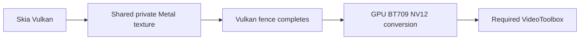

Explicit Vulkan requests previously rejected before rendering. This adds a separate macOS arm64 Skia Vulkan helper using checksum-pinned MoltenVK, public Metal-object texture sharing and a completed Vulkan fence before the retained GPU BT.709 NV12 converter and required VideoToolbox H.264/HEVC encoder. Existing Metal helper selection and protocol4/5/6/7 stay separate; Vulkan uses protocol8/9 with unchanged HGF5 commands. Mismatched backend/sharing/hardware receipts refuse publication.

The optional local installer pins the MoltenVK library and all56 headers, preserves differing installations and checks bounded download size/SHA before atomic installation. Vulkan queue/image/device ownership drains on failure; explicit initialization errors return cleanly. The transfer profiler now hooks Vulkan function-pointer dispatch and image-to-buffer readback, since the initial Metal-only profiler missed the intentional Vulkan RGBA control.

Validation on M3 Pro:219 portable tests pass (20 explicit hardware/path skips),5 native packet/boundary tests pass and9 Vulkan API checks pass. Both H.264 and HEVC independently pass300 indexed256×128 frames at30000/1001fps,20Mbps,GOP30,pool3: direct NV12/lossless byte binding, full decoded cadence/color/GOP and unchanged every-frame.995/40/35/35 floors. Actual300 command submissions/fences and GPU conversions/callback ownership are audited for both codecs. The expanded uncaptured profiler sees zero hooked raw downloads; both intentional NV12 and RGBA controls are detected. Four Vulkan CPU/import/extension/fence controls and five retained initialization/encoder/format controls refuse safely. Five focused receipt-guard mutations are caught after a passing baseline, with source restored.

A separate actual three-frame whole-device capture is excluded from transfer observations. Failed initial helpers/profiler controls, diagnostic attempts and ENOSPC builds are retained and excluded. Pointer-access intent and opaque driver/encoder transfers remain unknown; zeroCopyProved=false. This is bounded functional qualification: full4K Vulkan/HEVC, Linux Vulkan Video, Intel/Windows, GPU media and the production comparison remain open. No timing result or published M5 Max win is claimed. See the committed GPU-VULKAN-RESULTS.md for exact helper/runtime pins and qualification scope.
