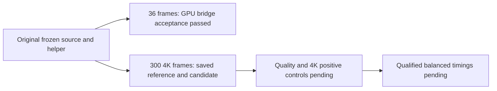

# Native Metal HEVC live bridge: partial delivery, 2026-10-05

The actual Metal → GPU NV12 → VideoToolbox HEVC bridge passed **36-frame, 256×128 acceptance**, with three-frame download controls and native device, encoder and HEVC-format refusal controls. This is functional and quality acceptance. **Full 300-frame 4K qualification and performance comparison remain pending.**

This follow-up keeps the original [2026-10-05 evidence snapshot](https://github.com/BintzGavin/helios-benchmarks/releases/tag/evidence-2026-10-05) unchanged. Its [separate evidence release](https://github.com/BintzGavin/helios-benchmarks/releases/tag/evidence-2026-10-05-live-hevc-partial) preserves the newly frozen delivery, including failures and the unfinished 4K media.

## Accepted bounded configuration

| Field | Value |
|---|---|
| Host/backend | M3 Pro, native Metal and required VideoToolbox HEVC |
| Extent / frame count | 256×128 / 36 |
| Source indices / cadence | 3..38 / 30/1 fps |
| Bitrate / GOP / native pool | 300 Mbps / 30 / 3 |
| Transport / native trace | binary protocol 7 / trace protocol 6 |
| Independent reference | Same producer NV12 bytes, pure planar split and lossless FFV1 |
| Every-frame floors | SSIM-Y ≥ .995; PSNR-Y/U/V ≥ 40/35/35 dB |
| Observed worst values | .999989 / 69.47 / 67.92 / 72.35 dB |
| Chroma / color | Centered, limited BT.709, with mandatory SPS conformance and copy-mux |

The [independent publication audit](../evidence/native-live-hevc-partial-20261005/INDEPENDENT-PUBLICATION-AUDIT.json) recomputes all 39 retained raw reference/control NV12 and planar hashes, checks 36 saved quality rows for each hardware/profile candidate, and recounts the actual GPU traces. It verifies ordered conversion, submission, callback, owner release and reuse for every bounded frame, with positive GPU timestamps. The preserved decoded YUV hash lists and cadence/color/GOP receipts match. No new renderer execution, video decode or benchmark was performed for this publication audit.

Uncaptured hardware/profile traces show zero hooked raw downloads. The positive controls detect three NV12 locks and three Metal texture-to-buffer transfers. Mapped-pointer intent, opaque driver/encoder transfers and total GPU memory remain unknown; **zeroCopyProved=false**. Positive controls at 256×128 do not qualify 4K.

## Preserved failures and pending 4K work

Generation 01's fault gate was invalidated because its injected fault shims did not load. Generation 02 atomically saved the 300-frame 4K candidate, then its outer watchdog failed when it inspected the renamed attempt path. Generation 03 freezes a commit-latch repair and three source-bound CPU regression receipts; live acceptance of that repair remains pending. All generations and original receipts remain preserved.

The unfinished 4K configuration is 3840×2160, 300 frames, source indices 3..302, 30/1 fps, HEVC at 300 Mbps, GOP 30 and native pool 3. Its five original reference/candidate media files are included as **unqualified evidence**, with the existing original byte hashes. This publication freshly hashes those source bytes before upload; it does not change the original owner's issuance-time audit claims. The 3,732,480,000-byte raw NV12 reference is distributed as lossless gzip to fit an individual release asset. [Media publication pins](../data/live-hevc-partial-media-pins.json) identify the compressed asset and the exact original byte size/hash to verify after decompression.

The 24.2709431250114-second acceptance export is excluded from benchmark results. Saved 4K evidence still requires all 300 frames to pass the unchanged quality/cadence/color/GOP gates, 4K download-positive controls and final independent acceptance. The active storage gates remain 9 GiB for serial qualification and 15 GiB for balanced retained outputs; the proposed 6 GiB streaming gate is disabled. The modified fframes pool/concurrency contract remains distinct from native pool 3. No production winner or M5 claim follows from this delivery.

## Receipts and restoration

The source-and-receipts ZIP contains **657 members**: 656 retained files plus the original manifest. The publication audit verifies every included file against its original size/SHA-256 and checks ZIP CRC. The five large media files are separate release assets; the original manifest explicitly records their omission from that ZIP.

Download the ZIP and desired media from the follow-up release, verify the asset size/SHA-256 in [publication receipts](../data/live-hevc-partial-publication.json), then extract the ZIP without executing any included scripts. For `4k-reference.nv12.gz`, decompress with `gzip -dk`, then verify the resulting 3,732,480,000 bytes against its original SHA-256 in the media pins. Existing absolute receipt paths document the original host layout; ZIP member paths are relative to the benchmark owner's task root.

Original reports: [final scope](../evidence/native-live-hevc-partial-20261005/FINAL-REPORT.json), [manifest](../evidence/native-live-hevc-partial-20261005/RECEIPT-MANIFEST.json), [saved partial audit](../evidence/native-live-hevc-partial-20261005/SAVED-RECEIPT-AUDIT.json), [resource gate](../evidence/native-live-hevc-partial-20261005/RESOURCE-GATE.json), [resume instructions](../evidence/native-live-hevc-partial-20261005/RESUME.txt).
